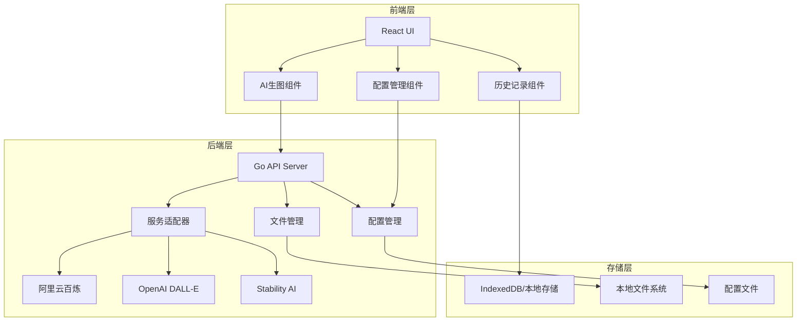

# AI 图像生成功能设计文档

## 概述

本设计文档描述了在现有 Prompt Fill 应用中集成 AI 图像生成功能的系统架构。系统采用前后端分离架构，支持 Web 和桌面双平台，使用 Go 后端处理 AI 服务调用，React 前端提供用户界面，通过 Wails 实现桌面应用打包。

系统设计原则：
- 增量开发，不修改现有代码
- 单用户应用，配置统一管理
- 支持多服务提供商扩展
- 平台一致性体验

## 架构

### 整体架构



### 技术栈

- **前端**: React + Vite + TailwindCSS
- **后端**: Go + Gin/Echo 框架
- **桌面应用**: Wails v2
- **存储**: 多种存储方案支持 (详见存储方案部分)
- **配置**: JSON 配置文件

## 存储方案

基于项目需求分析和开发简化考虑，推荐以下统一存储方案：

#### 统一方案：IndexedDB + Blob URLs (Web 和桌面版本)

**选择理由**：
- **开发简化**：Web 和桌面版本使用相同的存储逻辑，减少代码重复
- **Wails 兼容性**：Wails 桌面应用本质上运行在 WebView 中，完全支持 IndexedDB
- **功能一致性**：两个平台提供完全相同的存储功能和用户体验
- **维护成本低**：只需要维护一套存储代码

```typescript
interface StorageAdapter {
  saveImage(id: string, imageBlob: Blob, metadata: ImageMetadata): Promise<void>;
  getImage(id: string): Promise<{ blob: Blob; metadata: ImageMetadata }>;
  listImages(): Promise<ImageMetadata[]>;
  deleteImage(id: string): Promise<void>;
  clearAll(): Promise<void>;
  getStorageUsage(): Promise<{ used: number; quota: number }>;
  exportHistory(): Promise<Blob>; // 导出为压缩包
  importHistory(file: File): Promise<void>; // 从文件导入
}

// 统一的 IndexedDB 实现
class IndexedDBStorage implements StorageAdapter {
  private dbName = 'ai-image-history';
  private version = 1;
  private imageStore = 'images';
  private metadataStore = 'metadata';
  
  // 实现具体方法...
}
```

#### 平台差异处理

虽然存储统一使用 IndexedDB，但仍需要处理一些平台特定的功能：

**文件保存差异**：
```typescript
interface PlatformFileManager {
  saveImageFile(blob: Blob, filename: string): Promise<void>;
  copyImageToClipboard(blob: Blob): Promise<void>;
  showSaveDialog(defaultName: string): Promise<string | null>;
}

// Web 版本实现
class WebFileManager implements PlatformFileManager {
  async saveImageFile(blob: Blob, filename: string): Promise<void> {
    // 使用下载链接
    const url = URL.createObjectURL(blob);
    const a = document.createElement('a');
    a.href = url;
    a.download = filename;
    a.click();
    URL.revokeObjectURL(url);
  }
}

// 桌面版本实现 (通过 Wails API)
class DesktopFileManager implements PlatformFileManager {
  async saveImageFile(blob: Blob, filename: string): Promise<void> {
    // 调用 Wails 的文件保存对话框
    const arrayBuffer = await blob.arrayBuffer();
    const uint8Array = new Uint8Array(arrayBuffer);
    await window.go.main.App.SaveImageFile(Array.from(uint8Array), filename);
  }
}
```

### 存储容量管理

#### 容量限制策略
- **Web版本**：监控IndexedDB配额，接近限制时提醒用户清理
- **桌面版本**：监控磁盘空间，提供存储位置配置选项

#### 清理策略
- **LRU清理**：最近最少使用的记录优先清理
- **大小限制**：单个历史记录库最大容量限制
- **时间清理**：自动清理超过指定时间的记录

#### 备份和恢复
- **导出功能**：支持导出历史记录为压缩包
- **导入功能**：支持从备份文件恢复历史记录
- **同步功能**：桌面版和Web版之间的数据同步（可选功能）

## 组件和接口

### 前端组件

#### AIImageGenerator 组件
```typescript
interface AIImageGeneratorProps {
  prompt: string;
  onImageGenerated: (images: GeneratedImage[]) => void;
}

interface GeneratedImage {
  id: string;
  url: string;
  prompt: string;
  timestamp: number;
  provider: string;
  model: string;
  parameters: Record<string, any>;
  width?: number;
  height?: number;
}

interface APIError {
  code: string;
  message: string;
  provider: string;
  requestId?: string;
}
```

#### ImageModal 组件
```typescript
interface ImageModalProps {
  images: GeneratedImage[];
  isOpen: boolean;
  onClose: () => void;
  onSave: (image: GeneratedImage, action: 'download' | 'copy' | 'history') => void;
}
```

#### HistoryManager 组件
```typescript
interface HistoryRecord {
  id: string;
  image: GeneratedImage;
  savedAt: number;
  localPath?: string; // 桌面版本使用
}

interface HistoryManagerProps {
  records: HistoryRecord[];
  onDelete: (id: string) => void;
  onClearAll: () => void;
}
```

#### ErrorDisplay 组件
```javascript
interface ErrorDisplayProps {
  error: APIError;
  onRetry?: () => void;
  onClose: () => void;
}

// 错误显示组件 - 直接显示服务商返回的错误信息
const ErrorDisplay = ({ error, onRetry, onClose }) => {
  return (
    <div className="error-container">
      <div className="error-header">
        <h3>生成失败</h3>
        <button onClick={onClose}>×</button>
      </div>
      <div className="error-content">
        <div className="error-code">
          <strong>错误代码:</strong> {error.code}
        </div>
        <div className="error-message">
          <strong>错误信息:</strong> {error.message}
        </div>
        <div className="error-provider">
          <strong>服务商:</strong> {error.provider}
        </div>
        {error.requestId && (
          <div className="error-request-id">
            <strong>请求ID:</strong> {error.requestId}
          </div>
        )}
      </div>
      {onRetry && (
        <div className="error-actions">
          <button onClick={onRetry} className="retry-button">
            重试
          </button>
        </div>
      )}
    </div>
  );
};
```
```typescript
interface AIProviderConfig {
  id: string;
  name: string;
  apiKey: string;
  baseUrl?: string;
  models: string[];
  defaultModel: string;
  parameters: Record<string, any>;
}

interface ConfigurationPanelProps {
  providers: AIProviderConfig[];
  activeProvider: string;
  onConfigUpdate: (config: AIProviderConfig) => void;
  onProviderChange: (providerId: string) => void;
}
```

### 后端 API 接口

#### 图像生成接口
```go
// POST /api/v1/generate
type GenerateRequest struct {
    Prompt     string            `json:"prompt" binding:"required"`
    Provider   string            `json:"provider" binding:"required"`
    Model      string            `json:"model"`
    Count      int               `json:"count" validate:"min=1,max=10"`
    Size       string            `json:"size"`
    Parameters map[string]interface{} `json:"parameters"`
}

type GenerateResponse struct {
    Success bool              `json:"success"`
    Images  []GeneratedImage  `json:"images,omitempty"`
    Error   *APIError         `json:"error,omitempty"`
}

type GeneratedImage struct {
    ID       string `json:"id"`
    URL      string `json:"url"`
    Width    int    `json:"width,omitempty"`
    Height   int    `json:"height,omitempty"`
}

// 错误响应 - 直接返回服务商的原始错误信息
type APIError struct {
    Code      string `json:"code"`      // 服务商返回的错误代码
    Message   string `json:"message"`   // 服务商返回的错误消息
    Provider  string `json:"provider"`  // 服务提供商标识
    RequestID string `json:"requestId,omitempty"` // 服务商的请求ID
}
```

#### 配置管理接口
```go
// GET /api/v1/config
type ConfigResponse struct {
    Providers      []ProviderConfig `json:"providers"`
    ActiveProvider string           `json:"activeProvider"`
}

// POST /api/v1/config
type ConfigRequest struct {
    Provider string                 `json:"provider"`
    Config   map[string]interface{} `json:"config"`
}

// GET /api/v1/providers
type ProvidersResponse struct {
    Providers []ProviderInfo `json:"providers"`
}

type ProviderInfo struct {
    ID          string   `json:"id"`
    Name        string   `json:"name"`
    Models      []string `json:"models"`
    SizeOptions []string `json:"sizeOptions"`
}
```

#### 文件管理接口
```go
// POST /api/v1/files/save
type SaveFileRequest struct {
    ImageURL string `json:"imageUrl" binding:"required"`
    Filename string `json:"filename" binding:"required"`
    Path     string `json:"path"`
}

// GET /api/v1/files/{id}
// 返回图片文件流
```

### 服务适配器接口

#### 基础适配器接口
```go
type ImageProvider interface {
    GenerateImage(ctx context.Context, req *GenerateRequest) (*GenerateResponse, error)
    GetModels() []string
    GetSizeOptions() []string
    ValidateConfig(config map[string]interface{}) error
    ParseResponse(body []byte) (*GenerateResponse, error) // 新增：解析响应
}
```

#### 响应解析策略

每个服务提供商都有不同的响应格式，需要统一解析为标准格式：

**阿里云百炼响应解析**：
- **成功响应**：检查是否存在 `output` 字段
- **图像提取**：从 `output.choices[0].message.content` 数组中提取 `image` 字段
- **尺寸信息**：从 `usage.width` 和 `usage.height` 获取
- **错误响应**：检查是否存在 `code` 字段，直接提取 `code`、`message` 和 `request_id`

**通用解析流程**：
```go
func (d *DashScopeAdapter) ParseResponse(body []byte) (*GenerateResponse, error) {
    // 1. 尝试解析为错误响应
    var errorResp DashScopeError
    if json.Unmarshal(body, &errorResp) == nil && errorResp.Code != "" {
        return &GenerateResponse{
            Success: false,
            Error: &APIError{
                Code:      errorResp.Code,
                Message:   errorResp.Message,
                Provider:  "dashscope",
                RequestID: errorResp.RequestID,
            },
        }, nil
    }

    // 2. 解析为成功响应
    var successResp DashScopeResponse
    if err := json.Unmarshal(body, &successResp); err != nil {
        return nil, fmt.Errorf("failed to parse response: %w", err)
    }

    // 3. 提取图像信息
    var images []GeneratedImage
    for _, choice := range successResp.Output.Choices {
        for _, content := range choice.Message.Content {
            if content.Image != "" {
                images = append(images, GeneratedImage{
                    ID:     generateImageID(),
                    URL:    content.Image,
                    Width:  successResp.Usage.Width,
                    Height: successResp.Usage.Height,
                })
            }
        }
    }

    return &GenerateResponse{
        Success: true,
        Images:  images,
    }, nil
}
```

#### 阿里云百炼适配器
```go
type DashScopeAdapter struct {
    apiKey  string
    baseURL string
    client  *http.Client
}

// 请求结构
type DashScopeRequest struct {
    Model      string                 `json:"model"`
    Input      DashScopeInput         `json:"input"`
    Parameters DashScopeParameters    `json:"parameters"`
}

type DashScopeInput struct {
    Messages []DashScopeMessage `json:"messages"`
}

type DashScopeMessage struct {
    Role    string                   `json:"role"`
    Content []DashScopeContent       `json:"content"`
}

type DashScopeContent struct {
    Text string `json:"text"`
}

type DashScopeParameters struct {
    PromptExtend bool   `json:"prompt_extend"`
    Size         string `json:"size"`
}

// 成功响应结构
type DashScopeResponse struct {
    Output    DashScopeOutput `json:"output"`
    Usage     DashScopeUsage  `json:"usage"`
    RequestID string          `json:"request_id"`
}

type DashScopeOutput struct {
    Choices []DashScopeChoice `json:"choices"`
}

type DashScopeChoice struct {
    FinishReason string               `json:"finish_reason"`
    Message      DashScopeMessage     `json:"message"`
}

type DashScopeResponseMessage struct {
    Content          []DashScopeResponseContent `json:"content"`
    ReasoningContent string                     `json:"reasoning_content"`
    Role             string                     `json:"role"`
}

type DashScopeResponseContent struct {
    Image string `json:"image,omitempty"`
    Text  string `json:"text,omitempty"`
}

type DashScopeUsage struct {
    Height      int `json:"height"`
    ImageCount  int `json:"image_count"`
    InputTokens int `json:"input_tokens"`
    OutputTokens int `json:"output_tokens"`
    TotalTokens int `json:"total_tokens"`
    Width       int `json:"width"`
}

// 错误响应结构
type DashScopeError struct {
    RequestID string `json:"request_id"`
    Code      string `json:"code"`
    Message   string `json:"message"`
}
```

## 数据模型

### 配置数据模型
```json
{
  "providers": {
    "dashscope": {
      "name": "阿里云百炼",
      "apiKey": "",
      "baseUrl": "https://dashscope.aliyuncs.com",
      "models": ["z-image-turbo"],
      "defaultModel": "z-image-turbo",
      "sizeOptions": [
        "1536*1536",
        "1296*1728", 
        "1728*1296",
        "1152*2048",
        "864*2016",
        "2048*1152",
        "2016*864"
      ],
      "requestTemplate": {
        "model": "{{.Model}}",
        "input": {
          "messages": [
            {
              "role": "user",
              "content": [
                {
                  "text": "{{.Prompt}}"
                }
              ]
            }
          ]
        },
        "parameters": {
          "prompt_extend": false,
          "size": "{{.Size}}"
        }
      },
      "responseMapping": {
        "successIndicator": "output",
        "imagesPath": "output.choices[0].message.content",
        "imageUrlField": "image",
        "usagePath": "usage",
        "widthField": "width",
        "heightField": "height",
        "errorCodePath": "code",
        "errorMessagePath": "message",
        "requestIdPath": "request_id"
      }
    }
  },
  "activeProvider": "dashscope"
}
```

### 历史记录数据模型

#### 统一数据模型 (IndexedDB)
```typescript
interface HistoryRecord {
  id: string;
  prompt: string;
  images: {
    id: string;
    blobId: string; // IndexedDB中的blob引用
    thumbnailBlobId?: string;
    originalUrl?: string; // 原始API返回的URL（可能过期）
    mimeType: string;
    size: number;
  }[];
  provider: string;
  model: string;
  parameters: Record<string, any>;
  createdAt: number;
  savedAt: number;
  totalSize: number; // 所有图片的总大小，用于容量管理
}

// IndexedDB 存储结构
interface ImageBlob {
  id: string;
  data: Blob;
  mimeType: string;
  size: number;
  createdAt: number;
}

// IndexedDB 数据库结构
const DB_SCHEMA = {
  name: 'ai-image-history',
  version: 1,
  stores: {
    metadata: {
      keyPath: 'id',
      indexes: {
        createdAt: 'createdAt',
        provider: 'provider',
        savedAt: 'savedAt'
      }
    },
    images: {
      keyPath: 'id',
      indexes: {
        createdAt: 'createdAt',
        size: 'size'
      }
    }
  }
};
```

## 正确性属性

*属性是一个特征或行为，应该在系统的所有有效执行中保持为真——本质上是关于系统应该做什么的正式声明。属性作为人类可读规范和机器可验证正确性保证之间的桥梁。*
基于需求分析，以下是系统的核心正确性属性：

### 属性 1：图像生成工作流完整性
*对于任何*有效的提示词和配置，完整的图像生成工作流（按钮显示 → API调用 → 结果显示）应该按预期顺序执行，成功时显示图像，失败时显示错误信息和重试选项
**验证需求：1.1, 1.2, 1.3, 1.4**

### 属性 2：配置管理一致性
*对于任何*服务提供商选择，配置管理器应该显示该提供商对应的配置字段，并且配置更改应该立即生效
**验证需求：2.2**

### 属性 3：API调用和错误处理统一性
*对于任何*AI服务提供商的API调用，系统应该使用统一的接口进行调用，并且失败时应该正确提取和显示服务商特定的错误代码和消息
**验证需求：2.3, 7.2, 7.3, 7.4**

### 属性 4：文件操作完整性
*对于任何*成功生成的图像，文件管理器应该提供所有三种操作选项（另存为、复制、保存到历史），并且每种操作都应该正确执行其预期功能
**验证需求：3.1, 3.2, 3.3, 3.4**

### 属性 5：批量生成状态管理
*对于任何*批量生成请求，系统应该正确显示进度状态，完成时显示所有结果，部分失败时显示统计信息和重试选项
**验证需求：4.1, 4.2, 4.3, 4.4**

### 属性 6：历史记录存储条件性
*对于任何*图像生成操作，历史记录应该仅在用户明确选择"保存到历史记录"时才创建，并且应该包含完整的图像和提示词信息
**验证需求：5.3, 3.4**

### 属性 7：历史记录管理完整性
*对于任何*历史记录操作（查看、删除单个、清除全部），系统应该正确执行操作并同时处理数据库记录和关联文件，同时显示准确的存储使用信息
**验证需求：5.1, 5.2, 9.1, 9.2, 9.3, 9.4**

### 属性 8：跨平台行为一致性
*对于任何*功能操作，Web版本和桌面版本应该提供相同的功能结果和存储行为，仅在文件保存方式上有平台特定的实现差异
**验证需求：8.1, 8.2, 8.3**

## 错误处理

### 错误分类和处理策略

#### API调用错误处理原则
- **直接透传**：服务提供商返回的 `code` 和 `message` 直接显示给用户，不进行友好化处理
- **保留原始信息**：保留服务商的 `request_id` 用于问题追踪
- **统一格式**：所有服务商的错误都转换为统一的 `APIError` 格式

#### 阿里云百炼错误处理示例
```go
func (d *DashScopeAdapter) handleResponse(resp *http.Response) (*GenerateResponse, error) {
    body, err := io.ReadAll(resp.Body)
    if err != nil {
        return nil, err
    }

    // 尝试解析为错误响应
    var errorResp DashScopeError
    if err := json.Unmarshal(body, &errorResp); err == nil && errorResp.Code != "" {
        return &GenerateResponse{
            Success: false,
            Error: &APIError{
                Code:      errorResp.Code,
                Message:   errorResp.Message,
                Provider:  "dashscope",
                RequestID: errorResp.RequestID,
            },
        }, nil
    }

    // 解析为成功响应
    var successResp DashScopeResponse
    if err := json.Unmarshal(body, &successResp); err != nil {
        return nil, err
    }

    // 提取图像URL
    var images []GeneratedImage
    for _, choice := range successResp.Output.Choices {
        for _, content := range choice.Message.Content {
            if content.Image != "" {
                images = append(images, GeneratedImage{
                    ID:     generateImageID(),
                    URL:    content.Image,
                    Width:  successResp.Usage.Width,
                    Height: successResp.Usage.Height,
                })
            }
        }
    }

    return &GenerateResponse{
        Success: true,
        Images:  images,
    }, nil
}
```

#### 其他错误类型
- **网络错误**：显示网络连接问题，提供重试选项
- **配置错误**：提示检查API密钥和服务商配置
- **系统错误**：显示系统内部错误信息

### 错误恢复机制
- 自动重试：网络临时错误自动重试3次
- 降级处理：主要服务不可用时提示切换备用服务商
- 状态恢复：应用重启后恢复未完成的批量生成任务

## 测试策略

### 双重测试方法

本系统采用单元测试和基于属性的测试相结合的方法：

#### 单元测试
- **具体示例验证**：测试特定输入的预期输出
- **边界条件测试**：测试空输入、最大批量数量、无效配置等边界情况
- **错误条件测试**：模拟各种错误场景，验证错误处理逻辑
- **集成点测试**：测试前后端接口、存储接口的集成

#### 基于属性的测试
- **通用属性验证**：通过随机输入验证系统的通用正确性属性
- **配置**：每个属性测试运行最少100次迭代
- **标记格式**：**Feature: ai-image-generation, Property {number}: {property_text}**
- **需求追溯**：每个属性测试必须引用其验证的设计文档属性

#### 测试框架选择
- **前端**：Jest + React Testing Library + fast-check (属性测试)
- **后端**：Go testing + testify + gopter (属性测试)
- **集成测试**：Cypress (E2E) + API测试

#### 测试覆盖重点
- API适配器的正确性和一致性
- 文件操作的平台兼容性
- 错误处理的完整性
- 配置管理的有效性
- 历史记录的数据完整性

### 测试数据管理
- 使用模拟的AI服务响应进行测试
- 创建测试专用的配置文件
- 隔离测试环境的存储和文件系统操作

## 实现注意事项

### 性能考虑
- 图像缓存：生成的图像在内存中缓存，避免重复下载
- 懒加载：历史记录页面使用虚拟滚动，按需加载图像
- 压缩存储：历史记录中的图像使用适当压缩以节省存储空间

### 安全考虑
- API密钥加密存储在本地配置文件中
- 图像URL验证，防止恶意链接
- 文件路径验证，防止路径遍历攻击

### 可扩展性设计
- 服务适配器模式支持新的AI服务提供商
- 配置文件驱动的参数管理
- 插件化的文件处理器支持不同平台

### 用户体验优化
- 响应式设计适配不同屏幕尺寸
- 加载状态和进度指示
- 键盘快捷键支持
- 无障碍访问支持